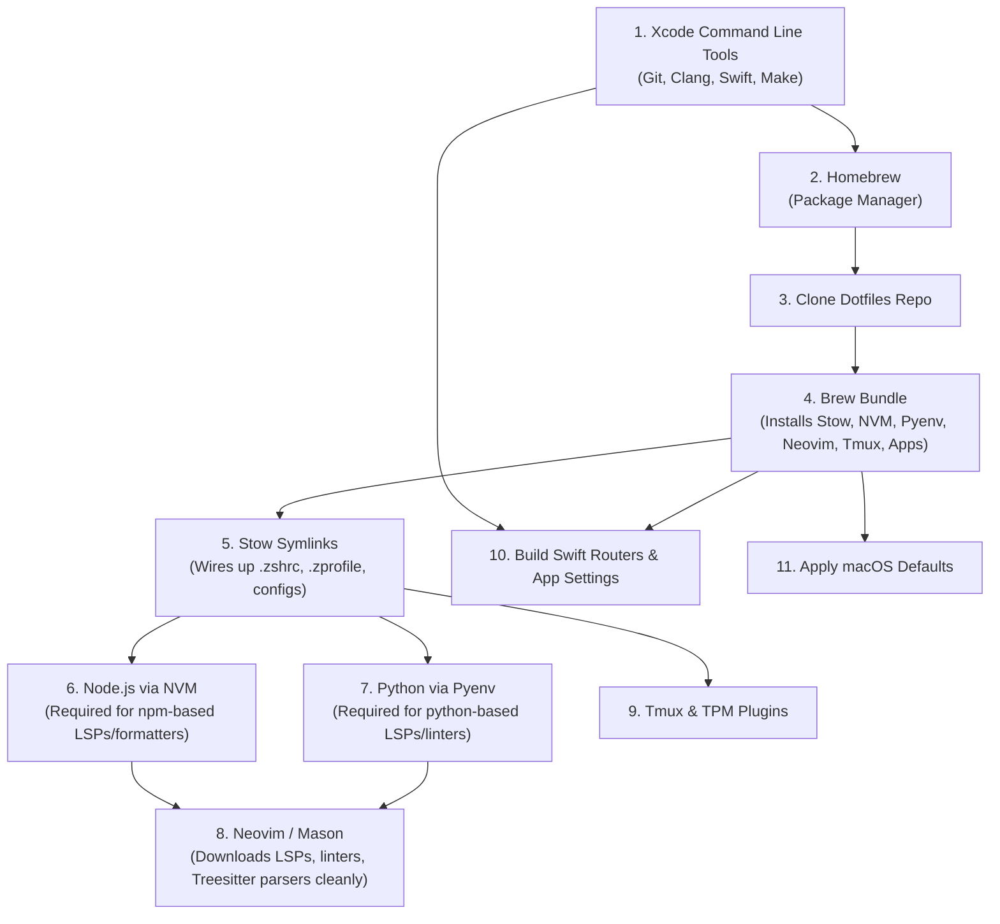

# ⚙️ Dotfiles

My personal macOS configuration files, development environment, and system preferences managed with [GNU Stow](https://www.gnu.org/software/stow/) and [Homebrew](https://brew.sh/).

---

## 📋 Table of Contents

- [Overview](#-overview)
- [Why the Installation Order Matters](#-why-the-installation-order-matters)
- [🚀 Step-by-Step Fresh Mac Installation Guide](#-step-by-step-fresh-mac-installation-guide)
  - [Step 1: Install Xcode Command Line Tools](#step-1-install-xcode-command-line-tools)
  - [Step 2: Install Homebrew](#step-2-install-homebrew)
  - [Step 3: Clone Dotfiles Repository](#step-3-clone-dotfiles-repository)
  - [Step 4: Install Brew Packages & Casks](#step-4-install-brew-packages--casks)
  - [Step 5: Symlink Dotfiles with GNU Stow](#step-5-symlink-dotfiles-with-gnu-stow)
  - [Step 6: Install Node.js via NVM](#step-6-install-nodejs-via-nvm)
  - [Step 7: Install Python via Pyenv](#step-7-install-python-via-pyenv)
  - [Step 8: Set Up Tmux & TPM Plugins](#step-8-set-up-tmux--tpm-plugins)
  - [Step 9: Initialize Neovim & Mason Tooling](#step-9-initialize-neovim--mason-tooling)
  - [Step 10: Apply macOS System Preferences](#step-10-apply-macos-system-preferences)
  - [Step 11: Build Routers & Load App Settings](#step-11-build-routers--load-app-settings)
  - [Step 12: Configure Keychain Secrets (Optional)](#step-12-configure-keychain-secrets-optional)
- [Repository Structure](#-repository-structure)
- [Daily Workflow & Helper Commands](#-daily-workflow--helper-commands)
  - [Homebrew Maintenance](#homebrew-maintenance)
  - [Application Settings Sync](#application-settings-sync)
  - [Quick Navigation & Shortcuts](#quick-navigation--shortcuts)

---

## 🌟 Overview

This repository configures a complete macOS development workstation featuring:

- **Terminal & Shell:** [Alacritty](https://alacritty.org/) / [Ghostty](https://ghostty.org/) + [Zsh](https://www.zsh.org/) + [Powerlevel10k](https://github.com/romkatv/powerlevel10k) + vi-mode + auto-suggestions + syntax highlighting + [fzf](https://github.com/junegunn/fzf).
- **Editors:** [Neovim](https://neovim.io/) (custom [lazy.nvim](https://github.com/folke/lazy.nvim) setup + [AstroNvim](https://astronvim.com/) alternative) & [Zed](https://zed.dev/).
- **Terminal Multiplexer:** [Tmux](https://github.com/tmux/tmux) with TPM, Tokyo Night theme, vi keybindings, and automatic session persistence.
- **macOS Utilities:** [Rectangle](https://rectangleapp.com/) (window management), [Maccy](https://maccy.app/) (clipboard manager), [Stats](https://github.com/exelban/stats) (menu bar metrics), [Thaw](https://github.com/stonerl/Thaw) (menu bar organizer), [Shortcat](https://shortcat.app/) (keyboard navigation), and [Browserino](https://github.com/AlexStrNik/Browserino) (URL routing).
- **Custom URL Handlers:** Native Swift helper apps for ClickUp deep links and Google Chrome Work profile routing.

---

## 🧠 Why the Installation Order Matters

On a fresh Mac, dependencies build on top of each other in a strict hierarchy:



1. **Xcode CLT** gives you `git`, compilers, and `swiftc`.
2. **Homebrew** gives you `brew`, CLI utilities, GUI casks, and runtime managers (`nvm`, `pyenv`, `stow`).
3. **GNU Stow** links your shell configuration so that `nvm`, `pyenv`, and your PATHs are automatically configured in every shell session.
4. **Node & Python** must be initialized **before** Neovim, so that Mason can install and run npm-based and pip-based Language Servers (e.g. `typescript-language-server`, `pyright`, `prettierd`, `black`) without errors.

---

## 🚀 Step-by-Step Fresh Mac Installation Guide

### Step 1: Install Xcode Command Line Tools

```bash
xcode-select --install
```
Click **Install** when prompted and wait for completion.

---

### Step 2: Install Homebrew

Install Homebrew:
```bash
/bin/bash -c "$(curl -fsSL https://raw.githubusercontent.com/Homebrew/install/HEAD/install.sh)"
```

Add Homebrew to your environment (Apple Silicon `/opt/homebrew`):
```bash
echo 'eval "$(/opt/homebrew/bin/brew shellenv)"' >> ~/.zprofile
eval "$(/opt/homebrew/bin/brew shellenv)"
```

---

### Step 3: Clone Dotfiles Repository

```bash
git clone https://github.com/moeezali2375/dotfiles.git ~/dotfiles
cd ~/dotfiles
```

---

### Step 4: Install Brew Packages & Casks

Install all CLI tools, GUI applications, development runtimes, and Nerd Fonts:

```bash
brew bundle --file=~/dotfiles/brew/Brewfile
```

#### Key Packages Installed:
- **CLI & Utilities:** `stow`, `git`, `gh`, `tmux`, `ripgrep`, `fzf`, `bat`, `ncdu`, `trash`, `glow`, `httpie`, `dockutil`, `cmake`, `gcc`
- **Shell & Themes:** `powerlevel10k`, `zsh-autosuggestions`, `zsh-syntax-highlighting`, `zsh-vi-mode`
- **Runtimes & Dev:** `nvm`, `pyenv`, `go`, `php@8.4`, `composer`, `luarocks`, `typescript`, `yarn`, `docker-compose`
- **Databases & Servers:** `mysql@8.0`, `redis`, `nginx`
- **Fonts:** `font-hack-nerd-font`, `font-cousine-nerd-font`
- **GUI Applications:** `alacritty`, `ghostty`, `zed`, `cursor`, `rectangle`, `maccy`, `shortcat`, `stats`, `thaw`, `browserino`, `docker-desktop`, `postgres-app`, `dbeaver-community`, `beekeeper-studio`, `obsidian`, `spotify`, `iina`, `lulu`, `keycastr`, `herd`, `hyperkey`, `sublime-merge`

---

### Step 5: Symlink Dotfiles with GNU Stow

Symlink configuration folders into `$HOME`:

```bash
cd ~/dotfiles
stow alacritty astro-nvim gh git nvim tmux zed zsh
```

> [!NOTE]
> If default configuration files already exist in your home directory (e.g. an existing `.zshrc`), remove them first so Stow can create symlinks cleanly:
> ```bash
> rm -f ~/.zshrc ~/.zprofile ~/.zshenv
> stow zsh
> ```

---

### Step 6: Install Node.js via NVM

Create the NVM directory, reload your shell to activate NVM from `.zshrc`, and install Node LTS:

```bash
mkdir -p ~/.nvm
source ~/.zshrc
nvm install --lts
nvm use --lts
```

Verify:
```bash
node -v
npm -v
```

---

### Step 7: Install Python via Pyenv

Install Python 3.12 (or your preferred version) and set it as global:

```bash
pyenv install 3.12.8
pyenv global 3.12.8
```

Verify:
```bash
python --version
pip --version
```

---

### Step 8: Set Up Tmux & TPM Plugins

1. Clone the Tmux Plugin Manager:
   ```bash
   git clone https://github.com/tmux-plugins/tpm ~/.tmux/plugins/tpm
   ```

2. Start Tmux:
   ```bash
   tmux
   ```

3. Inside Tmux, press `Ctrl + b` then `Shift + I` (`Ctrl+b` + `I`) to install plugins:
   - `vim-tmux-navigator`
   - `tmux-resurrect`
   - `tmux-continuum`
   - `tmux-powerkit` (Tokyo Night theme)

---

### Step 9: Initialize Neovim & Mason Tooling

Now that Node.js, Python, and Git are active in your PATH:

```bash
nvim
```

1. **Lazy.nvim** will automatically bootstrap and install all editor plugins.
2. **Mason.nvim** will automatically install all Language Servers, formatters, and linters defined in `nvim/.config/nvim/lua/mason-packages.lua` (including `typescript-language-server`, `pyright`, `intelephense`, `gopls`, `stylua`, `prettierd`, `black`, `shellcheck`, etc.).

To launch the AstroNvim alternative setup instead:
```bash
astro-nvim
```

---

### Step 10: Apply macOS System Preferences

Apply macOS system defaults:

```bash
macos-apply
```
*(or execute `~/dotfiles/macos/set-defaults.sh`)*

**Applied Settings:**
- **Dock:** Left alignment, autohide (0.15s animation), no recent apps, pinned apps & folder stacks via `dockutil`.
- **Keyboard:** Remaps Caps Lock to Escape (`hidutil` + persistent modifier mapping), fast key repeat rate (2), short initial delay (15), full keyboard navigation.
- **Finder:** List view (`Nlsv`), show extensions, default target `~/Downloads`, auto-empty trash (30 days).
- **Screenshots:** Saved to `~/Pictures/ScreenShots` with Computer Name prefix.
- **Trackpad:** Tap-to-click, 2-finger right click, 3/4-finger swipe gestures.
- **Menu Bar:** 24-hour clock, battery percentage shown, day of week enabled.

---

### Step 11: Build Routers & Load App Settings

Build the custom Swift URL routers (ClickUp native link router & Chrome Work profile launcher) and import `.plist` configurations:

```bash
# 1. Build Swift apps & load Browserino routing rules
browserino-load

# 2. Window snapping shortcuts
rectangle-load

# 3. Clipboard manager settings
maccy-load

# 4. Menu bar system monitor layout
stats-load

# 5. Menu bar icon organizer settings
thaw-load

# 6. Keyboard UI navigation settings
shortcat-load
```

---

### Step 12: Configure Keychain Secrets (Optional)

`zsh/.secrets.zsh` reads credentials securely from macOS Keychain using `security`. To store API keys:

```bash
# OpenAI API Key
security add-generic-password -a "$USER" -s "openai_api_key" -w "<YOUR_OPENAI_API_KEY>"

# GitHub Personal Access Token
security add-generic-password -a "$USER" -s "github_token" -w "<YOUR_GITHUB_TOKEN>"
```

---

## 📁 Repository Structure

```
dotfiles/
├── alacritty/               # Alacritty terminal config & Coolnight theme
│   └── .config/alacritty/
├── astro-nvim/              # AstroNvim v5 alternative configuration
│   └── .config/astro-nvim/
├── brew/                    # Homebrew dependencies bundle
│   └── Brewfile
├── browserino/              # Browserino URL router configs & Swift helper builds
│   ├── ChromeWork/          # Swift launcher for Google Chrome Work profile
│   ├── ClickUpRouter/       # Swift deep linker for ClickUp native app
│   └── xyz.alexstrnik.Browserino.plist
├── gh/                      # GitHub CLI configuration
│   └── .config/gh/
├── git/                     # Git configurations
│   ├── .gitconfig           # Main user Git config
│   ├── .gitconfig_dubizzle  # Include for work repos (~/Developer/dubizzle/)
│   └── .gitignore_global    # Global git ignore file
├── maccy/                   # Maccy clipboard manager preferences plist
├── macos/                   # macOS system defaults script
│   └── set-defaults.sh
├── nvim/                    # Primary Neovim configuration (Lazy.nvim)
│   └── .config/nvim/
├── rectangle/               # Rectangle window manager preferences plist
├── shortcat/                # Shortcat keyboard navigation preferences plist
├── stats/                   # Stats menu bar system monitor preferences plist
├── thaw/                    # Thaw menu bar manager preferences plist
├── tmux/                    # Tmux configuration (.tmux.conf)
├── zed/                     # Zed editor settings (Vim mode, themes)
│   └── .config/zed/
├── zsh/                     # Zsh configuration files
│   ├── .aliases.zsh         # Command shortcuts and load/dump aliases
│   ├── .p10k.zsh            # Powerlevel10k theme configuration
│   ├── .secrets.zsh         # Keychain-backed environment secrets
│   ├── .zprofile            # Login shell PATHs (Homebrew, Go, Mason, etc.)
│   ├── .zshenv              # Environment variables & XDG base dirs
│   └── .zshrc               # Interactive shell setup (plugins, fzf, vi mode)
└── .stow-global-ignore      # Ignored patterns for GNU Stow
```

---

## ⚡ Daily Workflow & Helper Commands

The repository includes convenient aliases defined in `zsh/.aliases.zsh`:

### Homebrew Maintenance

| Command | Action |
| :--- | :--- |
| `brew-install` | Installs/syncs packages from `~/dotfiles/brew/Brewfile` |
| `brew-dump` | Dumps currently installed packages and casks into `Brewfile` |

### Application Settings Sync

Export or import macOS app preferences (`.plist` files) between your system and this repository:

| Application | Export / Save Config | Import / Apply Config |
| :--- | :--- | :--- |
| **macOS Defaults** | — | `macos-apply` |
| **Browserino & Routers** | `browserino-dump` | `browserino-load` |
| **Rectangle** | `rectangle-dump` | `rectangle-load` |
| **Maccy** | `maccy-dump` | `maccy-load` |
| **Stats** | `stats-dump` | `stats-load` |
| **Thaw** | `thaw-dump` | `thaw-load` |
| **Shortcat** | `shortcat-dump` | `shortcat-load` |

### Quick Navigation & Shortcuts

| Command | Description |
| :--- | :--- |
| `cddo` | Quick jump to `~/dotfiles/` |
| `cdd` | Quick jump to `~/Developer/dubizzle/` |
| `cdn` | Quick jump to `~/Developer/novasoft/` |
| `astro-nvim` | Launch Neovim with AstroNvim config (`NVIM_APPNAME=astro-nvim nvim`) |
| `gi <lang>` | Fetch `.gitignore` template from toptal API (e.g., `gi node,macos >> .gitignore`) |
| `gs` | `git status` |
